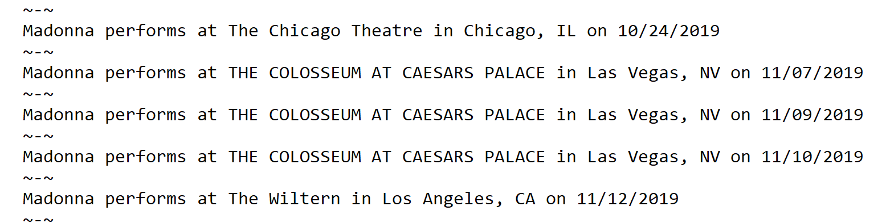
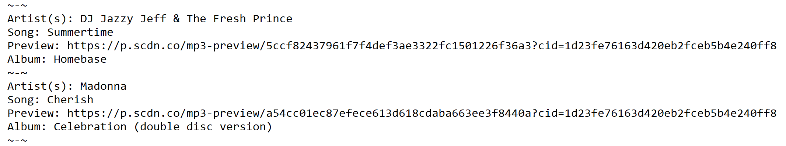
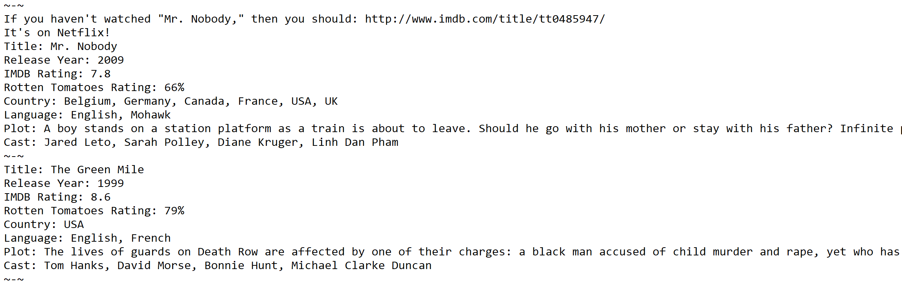

# liri-node-app
LIRI is a _Language_ Interpretation and Recognition Interface that works with the command line node app, which takes in parameters and gives back data.

# How to use
1. Open a console app such as Bash.
2. Navigate to the liri.js file in `liri-node-app/assets/javascript/`
3. Enter one of the following commands:
    * `node liri concert-this '<artist/band name here>'`
        ** Results: Upcoming concert schedule for artist/band entered, including venue, location, & date will be shown in the console and logged in the log.txt file. If an artist/band is not entered, you will be reminded to enter one and brought back to the beginning to try again.
        
    * `node liri spotify-this-song '<song name here>'`
        ** Results: Artist, song name, album, & preview link will be shown in the console and logged in the log.txt file. If an artist/band is not entered, the results will default to "The Sign" by Ace of Base.
        
    * `node liri movie-this '<movie name here>'`
        ** Results: Ratings, plot, actors, year, country, & language of movie entered, will be shown in the console and logged in the log.txt file. If a movie is not entered, results will be for the movie 'Mr. Nobody.'
        
    * `node liri do-what-it-says`
        ** Results: whichever of the above commands is in the random.txt file, will give those results in the console and log.txt file.

    * If no command is entered, a list of the possible commands will be shown in the console.

### [Try the App!](https://github.com/Edestiny7/liri-node-app)

Technology: JavaScript | Node.js | Git | API